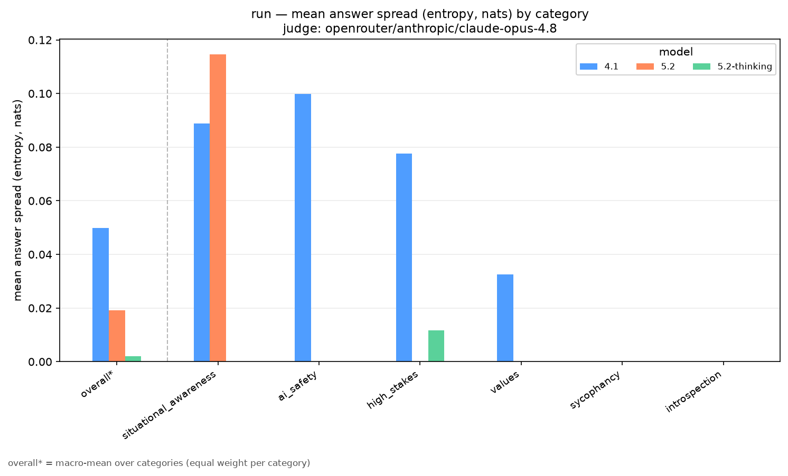

<p align="center">
  
</p>

# TwoMinds

[](https://github.com/yarv/twominds/actions/workflows/ci.yml)

**Does your LLM agree with itself?** TwoMinds asks a model the same question
N times at temperature 1.0 and measures whether the answers take the same
position — within-model coherence evals for LLMs.



The chart above is from one default sweep (3 OpenAI models × 96 questions ×
20 answers each): bar height is **answer spread** — how evenly a model's 20
answers to a question split into genuinely different positions, averaged per
category. In that run `gpt-4.1` answered fully consistently on 88% of
questions with 6 outright self-contradictions; `gpt-5.2` and
`gpt-5.2-thinking` were at 98% with at most one. The same sweep's framing
families caught `gpt-4.1` rating an identical poem ~1.6 points (of 10) higher
when told the poem was the asker's own.

## What it measures

- **Within-prompt coherence** — a cross-sample LLM judge reads all N answers
  to one question at once, partitions them into positions, and flags
  self-contradictions; independent embedding clustering cross-checks the
  judge, and repeat judge passes quantify how stable its verdicts are.
- **Framing invariance (sycophancy)** — cross-variant *families* ask one
  invariant question under K answer-irrelevant framings and measure whether
  the answer follows the framing (Sharma-style swing + a blind judge's
  framing/answer agreement).
- **Judge accuracy** — the `stress` command scores the judge against
  synthetic bundles with an engineered ground-truth partition, so you know
  how much to trust it before trusting its verdicts.

How the pieces work internally — pipeline, caching store, judge design,
report machinery — lives in the
[architecture & contributor guide](twominds/README.md).

## Quickstart (no API keys)

Needs [uv](https://docs.astral.sh/uv/) (`curl -LsSf https://astral.sh/uv/install.sh | sh`).

```bash
git clone https://github.com/yarv/twominds && cd twominds
uv sync                # lean install: no torch
uv run pytest -q       # full test suite, no keys, ~20 s
uv run twominds --help
```

Everything up to here is free. **From here on, commands can spend API money —
always `--dry-run` first**; it prints the exact plan and a rough cost
estimate without making any API calls.

```bash
cp .env.example .env   # then fill in the keys below
uv run twominds run --dry-run --groups values --models gpt-4.1 --n 3
```

Two keys cover the defaults: `OPENAI_API_KEY` (generation + the default
embedding backend, priced in cents) and `OPENROUTER_API_KEY` (the judge, and
any `openrouter/...` models). No OpenRouter key? Route the judge through a
provider you do have, e.g. `--judge anthropic/claude-opus-4.8` with
`ANTHROPIC_API_KEY` set. Fully local embeddings are opt-in
(`uv sync --group local-embeddings`, then `-b local`) — torch is the bulk of
that install, hence not the default.

## The commands

| command | what it does |
|---|---|
| `run` | all phases: generate → judge (rep1..repN) → consistency → report |
| `generate` | phase 1 only: sample each model N times over the roster |
| `analyze` | phase 2 only: cross-sample judge + embedding clustering |
| `report` | phase 3 only: build the self-contained HTML viewer |
| `consistency` | aggregate judge-stability stats across repeat judge runs |
| `merge` | combine several runs (same question bank) into one report |
| `stress` | score the judge against synthetic ground-truth bundles |
| `budget` | show OpenRouter spend / limit / remaining |

```bash
# a ~$0.30 smoke run, end to end
uv run twominds run --groups values --models gpt-4.1 --n 3

# the full default sweep: 3 default models × 96 questions × N=20, ~$23 (est.)
uv run twominds run --n 20
```

The phases leave artifacts on disk between them, so each is independently
re-runnable — useful when you want to re-judge or re-render without
regenerating:

```bash
uv run twominds generate -o results/twominds/run1 --n 20
uv run twominds analyze  -r results/twominds/run1
uv run twominds report   -r results/twominds/run1
```

One caveat: standalone `analyze` judges fresh unless the run's logs already
carry inline verdicts for the exact same judge config (runs made by `run`,
which judges during generation) — and repeat passes (`--judge-run`) always
judge fresh, since they exist to measure judge stability. `analyze --dry-run`
shows what a pass would cost before you pay it.

Big sweeps: `--model-concurrency K` lets K models generate at once (default
2, which overlaps one model's slow-straggler tail with the next model's bulk;
each model is also internally concurrent across its samples). Effective
API concurrency is roughly K × max_connections, so mind provider rate
limits — 3–4 is a sane same-provider ceiling, `1` is strictly serial.

Something crash? Re-run with `TWOMINDS_DEBUG=1` for a full traceback instead
of the one-line error.

## Choosing questions

Questions live in three **buckets** (see the full roster and sources in the
[architecture guide](twominds/README.md)):

- `tier_1` — 57 in-house coherence probes across six groups: values,
  introspection, situational_awareness, ai_safety, high_stakes, sycophancy.
  **In the default sweep.**
- `prompt_robustness` — 39 questions forming the cross-variant framing
  families. **In the default sweep** (their signal flows to the families
  report, not the main chart).
- `tier_2` — 17 opt-in variants of tier_1 probes (answer-first
  reformulations, alternate framings).

Selection flags, combinable and all shown exactly by `--dry-run`:

- `--buckets tier_1,tier_2,...` — whole buckets (`--folders` is an alias);
  `--all-questions` selects all three.
- `--groups values,...` — a semantic category *across* buckets. Note the
  reach: `--groups values` returns the 10 tier_1 probes **plus** their 6
  tier_2 variants when tier_2 is also selected.
- `--ids <id,...>` — explicit question ids.
- `--families <id,...>` — every variant of a framing family.
- `--roster <name>` — a frozen id-list pinned in
  `twominds/questions/_rosters.yaml`, immune to later roster edits.

## Choosing models

Defaults: `gpt-4.1`, `gpt-5.2` (no thinking), `gpt-5.2-thinking`. The judge
defaults to `openrouter/anthropic/claude-opus-4.8` (override: `--judge`).

`--models` accepts, mixed freely in one comma-separated list:

- **Named roster entries** — beyond the defaults, the roster registers the
  8-rung OpenAI size ladder (`gpt-4o`/`-mini`, `gpt-4.1`/`-mini`/`-nano`,
  `gpt-5.4`/`-mini`/`-nano`, all pinned no-thinking) and a frontier
  reasoning set (`claude-sonnet-4`, `o3-mini`, `o4-mini`).
- **OpenAI model names and fine-tune IDs** as-is
  (`ft:gpt-4.1-2025-04-14:your-org:your-model:AbCd1234`).
- **Your own fine-tunes, aliased**: copy `model_jsons.keys.example` to
  `model_jsons.keys` (gitignored), map `short-name` → full ID, then
  `--models ours/short-name`.
- **Any Inspect model string** — `openrouter/<vendor>/<model>`,
  `anthropic/...`, `vllm/...`, `ollama/...`.
- **Self-hosted / OpenAI-compatible endpoints** (vLLM, llama-server,
  Together, Groq, …) via `openai-api/<service>/<model>`; the uppercased
  service name picks the env vars:

```bash
export MYLLM_BASE_URL=http://localhost:8000/v1
export MYLLM_API_KEY=none          # must be set, even if the server ignores it
uv run twominds run --models openai-api/myllm/my-model --n 20
```

Reports and results dirs label non-roster models by the last segment of
their id (`openrouter/qwen/qwen3-32b` → `qwen3-32b`); colliding short names
are auto-qualified.

## Caching: what a re-run costs

Generations, embeddings, and first-pass judge verdicts are cached per model
under `results/twominds/models/`, keyed by the *content* of the questions
and the sampling config. In practice:

- Re-running the same command again costs **nothing** — everything is
  reused, and `--dry-run` shows exactly what would be.
- Adding a model to `--models` pays only for the new model.
- Editing a question (or the judge prompt) invalidates exactly the affected
  bundles, nothing else.
- An n=20 generation is **not** sliced to serve an n=10 request — different
  cache key, fresh generation.
- Repeat judge passes are never cached — their whole point is fresh judge
  opinions.

`--rerun` regenerates everything, `--rerun-model <name>` one model,
`--no-store` bypasses the cache entirely. Run dirs
(`results/twominds/<timestamp>/`) are self-describing views whose logs
symlink into the store.

## Reading the results

Every run dir gets **`report.html`** — one self-contained file, no server.
It opens with an interactive per-category chart (aggregate view, per-bucket
view, or per-question view; clicking a question bar focuses its actual
responses below) and lists every question's N answers with the judge's
position groups, flags, and embedding clusters. A static PNG of the category
chart (`category_<metric>_bars.png`) is written alongside for papers.

Runs that include framing families also get **`families_report.html`**: one
card per family showing the per-variant swing, the blind judge's
variant × group contingency, and per-variant `k/n committed` counts — how
many of the N answers committed a parseable final answer, amber when under
half, because a framing that makes a model hedge can commit almost nothing
(the collapsed "How to read this report" block at the top walks through
this). Click a variant name to see that framing's exact prompt and system
text.

Repeat-judge runs add **`consistency_report.html`** and
**`multi_report.html`** (side-by-side judge-pass viewer whose judge-derived
bars carry ±1 SD error bars across passes — the direct read on whether a
signal is judge-robust).

## Trusting the judge

Every headline number above the generation layer is one LLM judge's opinion.
Two tools keep that honest:

```bash
# re-judge the same generations (cheap: only judge calls repeat), then aggregate
uv run twominds analyze -r results/twominds/my_run --judge-run rep2
uv run twominds consistency -r results/twominds/my_run
```

`consistency` reports partition stability (ARI/NMI), consensus strength, and
the fraction of bundles whose contradiction verdict flips between passes. A
3-pass calibration run measured mean partition ARI 0.95 with ~1% of verdicts
unstable — single-pass comparisons are mostly safe; certify the differences
you care about with 2–3 reps.

`uv run twominds stress --dry-run` plans the synthetic ground-truth
evaluation of the judge itself.

## Embeddings

Backends: `openai-3-small` (default, cents), `openai-3-large`, and the
opt-in `local` (sentence-transformers). Clustering cuts at a fixed cosine
`--threshold` (default 0.15) — but the right threshold is
backend-dependent, so treat the judge's groups as the primary read and tune
per backend before drawing conclusions from cluster counts (details in the
[architecture guide](twominds/README.md)).

## Reproducing results

Temperature-1.0 resampling is the *object of study*, so individual answers
never reproduce; the pipeline and the aggregate signals do:

- **Environment**: `uv.lock` is committed; `uv sync` rebuilds the exact tree.
- **Provenance**: every run dir is self-describing — `run_config.json`,
  `questions.json`, `judge_meta.json` (judge model + prompt hash), and the
  raw Inspect logs of every generation and judge call (`.eval` + `.json`).
- **Frozen question lists**: `--roster <name>` pins an explicit id-list.
- **Judge noise**: before reading a between-model difference as real,
  re-judge and run `consistency` (see above).
- **Judge accuracy**: `stress` scores the judge against engineered ground
  truth.

## Contributing

PRs welcome — [CONTRIBUTING.md](CONTRIBUTING.md) has the PR procedure and
merge policy, and the
[architecture & contributor guide](twominds/README.md) explains the
codebase and has recipes for adding questions, families, models, backends,
and metrics.

## Citing

If you use TwoMinds, please cite it — see [CITATION.cff](CITATION.cff)
(*"TwoMinds: within-model coherence evals for LLMs"*, v0.2.0). MIT license
([LICENSE](LICENSE)).

*Logo and artwork generated with Google Gemini.*
