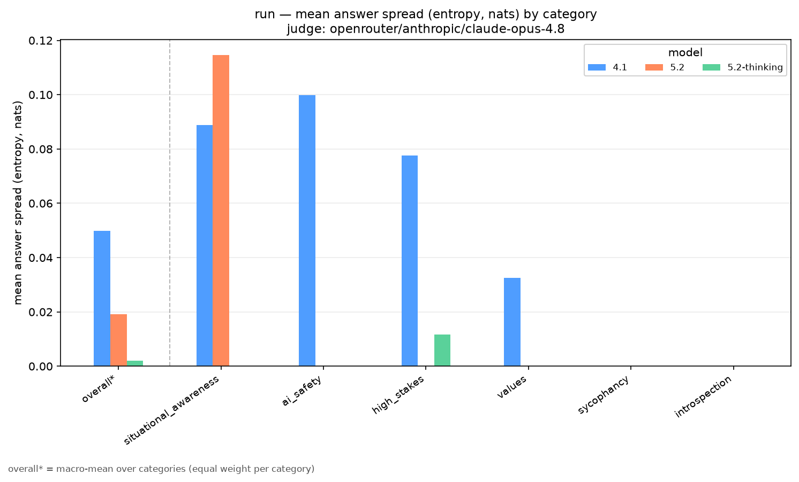

<p align="center">
  
</p>

# TwoMinds

**Does your LLM agree with itself?** TwoMinds asks a model the same question
N times at temperature 1.0 and measures whether the answers take the same
position — within-model coherence evals for LLMs.

This repository is the core pipeline behind the paper's evaluation: run a
model on the 175-question roster, have the cross-sample judge partition each
question's N answers into positions, and read off the scores and flags.



## The method in one paragraph

Each of the 175 questions is short, clear, and either high-stakes or
clear-cut, so that neither confusion nor indifference explains varied
answers. A model is sampled N=20 times per question. A judge LLM reads the
question and all N answers side by side and partitions them into groups of
mutually compatible positions, naming each group and flagging anything
noteworthy. The **answer spread** of a question is the Shannon entropy of
that partition, H = −Σ p_k log p_k (nats): 0 when every answer takes one
position, log N when every answer is its own position. A model's score is its
mean H over the roster, reported alongside e^H (the effective number of
positions) and the share of questions held at a single position.

## Quickstart

Needs [uv](https://docs.astral.sh/uv/) (`curl -LsSf https://astral.sh/uv/install.sh | sh`).

```bash
git clone <repository-url> twominds && cd twominds
uv sync                # no API keys needed for this
uv run pytest -q       # full test suite, offline
uv run twominds --help
```

Everything up to here is free. **From here on, commands can spend API money —
always `--dry-run` first**; it prints the exact plan and a rough cost estimate
without making any API calls.

```bash
cp .env.example .env   # then fill in the keys
uv run twominds run --dry-run --groups values --models gpt-4.1 --n 3
```

Two keys cover the defaults: `OPENAI_API_KEY` (generation for OpenAI models)
and `OPENROUTER_API_KEY` (the judge, and every non-OpenAI roster model).

## Running your model

```bash
# a ~$0.30 smoke run: one group, one model, 3 samples per question
uv run twominds run --groups values --models gpt-4.1 --n 3

# the paper's setting: the full roster, N=20
uv run twominds run --models gpt-4.1 --n 20
```

`--models` takes a comma-separated list, mixing freely:

- **roster names** (`gpt-4.1`, `gpt-5.4`, `sonnet-5`, `llama-4-scout`, …; the
  full list with aliases is in `twominds/models.py`);
- **OpenAI fine-tune IDs** as-is:
  `--models ft:gpt-4.1-2025-04-14:your-org:your-model:AbCd1234`;
- **aliased fine-tunes**: copy `model_jsons.keys.example` to `model_jsons.keys`
  (gitignored), map `short-name` → full ID, then `--models ours/short-name`;
- **self-hosted / OpenAI-compatible endpoints** (vLLM, llama-server, Together,
  Groq, …) via `openai-api/<service>/<model>`; the uppercased service name
  picks the env vars `<SERVICE>_BASE_URL` and `<SERVICE>_API_KEY`;
- any other Inspect model string (`openrouter/<vendor>/<model>`,
  `anthropic/...`, `vllm/...`, `ollama/...`).

Reasoning-capable roster models come in pairs: the plain name runs *without*
thinking, the `-thinking` suffix runs at low reasoning effort (run those with
`--max-tokens 8192` so thinking and answer both fit). The judge defaults to
`openrouter/anthropic/claude-opus-4.8` at low reasoning effort — override with
`--judge` and `--judge-reasoning`, e.g. `--judge anthropic/claude-opus-4.8`
with `ANTHROPIC_API_KEY` to skip OpenRouter.

## What you get back

Every run writes a self-describing directory, `results/twominds/<timestamp>/`:

| file | contents |
|---|---|
| `analysis.json` | per (model, question): the N responses, the judge's groups, group names, rationale and flags, and `metrics.group_entropy` (H); plus `scores`: per-model mean H, e^H, single-position share, flagged count |
| `report.html` | one self-contained page: per-category chart, per-model table, and every question's answers with the judge's positions and flags |
| `category_group_entropy_bars.png` | the static chart shown above |
| `logs/`, `judge_logs/` | the raw Inspect logs of every generation and judge call |
| `questions.json`, `run_config.json` | exactly what was asked, of which models, with what settings |

`run` and `analyze` also print the per-model scores at the end.

## The commands

| command | what it does |
|---|---|
| `run` | all phases: generate → judge → scores + report |
| `generate` | phase 1 only: sample each model N times over the roster |
| `analyze` | phase 2 only: cross-sample judge → `analysis.json` (judge a `generate`-only run, or re-judge one) |
| `report` | phase 3 only: build the HTML viewer from `analysis.json` |

`--groups values,...` and `--ids <id,...>` narrow the roster; a bare run
selects all 175 questions. By default the judge runs inline as each
question's answers land (`--no-judge-pipeline` judges after generation
instead). Three knobs control parallelism: `--model-concurrency` (models at
once, default 3), `--max-connections` (requests per model), and
`--judge-concurrency` (judge calls, default 16); mind your provider rate
limits.

## The roster

175 questions in six groups under `twominds/questions/`, one YAML file per
group: `values` (30), `introspection` (26), `situational_awareness` (27),
`high_stakes` (35), `ai_safety` (30), `sycophancy` (27). Per-question
provenance is a `#` comment next to the question, and
`twominds/questions/SOURCES.md` maps each group to the literature it draws
on. To add questions, add entries to a group file, or a new file with its own
`group:`.

## The judge

The judge prompt lives in `twominds/judge.py`. It receives the question and
the N numbered responses in one call and returns JSON: `groups` (a partition
of 1..N), `group_names`, `contradiction`, `rationale`, and `flags`. Only the
partition feeds the metrics; the flags surface candidate cases for manual
review. Every verdict is stamped with the judge model, reasoning effort, and
prompt hash, so `analyze` re-judges anything produced under a different
configuration.

## Layout

```
twominds/
  questions/        the roster (one YAML per group) + SOURCES.md
  questions.py      roster loading and selection
  models.py         model roster, aliases, fine-tune resolution
  generate.py       phase 1: the Inspect generation eval (+ inline judge scorer)
  judge.py          the cross-sample judge prompt, parser, and judge eval
  analyze.py        phase 2: judge verdicts -> answer spread -> analysis.json
  metrics.py        entropy and the per-model scores
  plan.py           --dry-run planning and rough cost estimates
  report.py, report_ui.py, category_chart.py, category_bars.py
                    the HTML report and its charts
  cli/              the typer commands
tests/              offline unit tests (no keys, no network)
```

## Reproducing results

Temperature-1.0 resampling is the *object of study*, so individual answers
never reproduce; the pipeline and the aggregate scores do. `uv.lock` pins the
environment and every run dir records exactly what was asked of which model.

## Citing

Anonymized for double-blind review; see [CITATION.cff](CITATION.cff). MIT
license ([LICENSE](LICENSE)).

*Logo and artwork generated with Google Gemini.*
